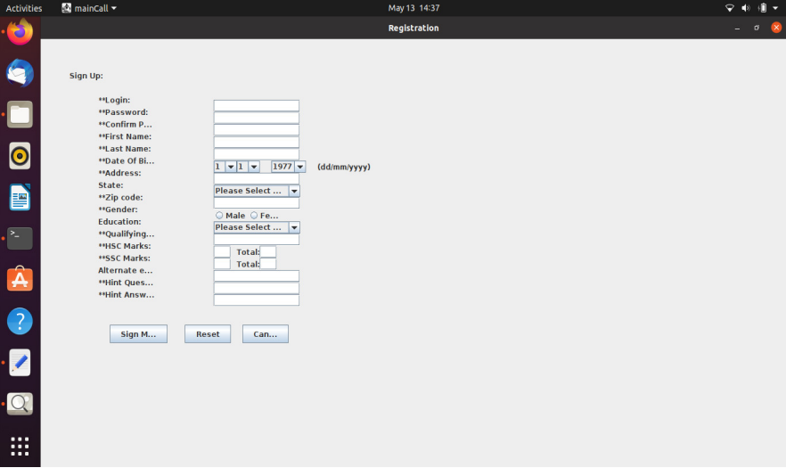

# Quiz Application

<p align="center">
   <div class="row">
	   
	   
	   
   </div>
   <div class="row">
	   
	   
	   
   </div>
</p>

## Table of Contents
1. [Introduction](#introduction)
2. [Features](#features)
3. [Technologies Used](#technologies-used)
   - [Hardware Requirements](#hardware-requirements)
   - [Software Requirements](#software-requirements)
4. [Installation](#installation)
5. [Usage](#usage)
6. [Database Design](#database-design)
7. [License](#license)

## Introduction
The "Quiz Application" is a comprehensive platform that offers a variety of quizzes, including technical, games, sports, and more. It allows users to attempt quizzes, earn credit scores for correct answers, view answers, resolve queries, and contribute their own questions and answers. This application aims to enhance user engagement and knowledge expansion through interactive and informative quizzes.

## Features
- Multiple quiz categories: Technical, games, sports, etc.
- Score tracking for correct answers
- Detailed answers and explanations for each question
- User query resolution
- User-generated content: Upload questions and answers

## Technologies Used

### Hardware Requirements
- Processor: Intel i3 or higher
- RAM: 4GB or more
- Hard Disk: 500GB or more
- Internet connection for online functionalities

### Software Requirements
- Operating System: Windows 10 or higher / macOS / Linux
- Database: MySQL or PostgreSQL
- Backend: Node.js or Django
- Frontend: React.js or Angular
- Development Environment: Visual Studio Code or IntelliJ IDEA

## Installation
1. Clone the repository:
   ```sh
   git clone https://github.com/username/quiz-application.git
   ```
2. Navigate to the project directory:
   ```sh
   cd quiz-application
   ```
3. Install the required dependencies:
   ```sh
   npm install
   ```
4. Set up the database:
   ```sh
   // Database setup commands
   ```
5. Start the development server:
   ```sh
   npm start
   ```

## Usage
1. Open the application in a web browser:
   ```sh
   http://localhost:3000
   ```
2. Register or log in to your account.
3. Select a quiz category and start playing.
4. Submit your answers and view your score.
5. Use the query feature to ask questions or view detailed answers.
6. Contribute by uploading your own questions and answers.

## Database Design
- **Users Table**: Stores user information (ID, username, password, email).
- **Quizzes Table**: Stores quiz details (ID, category, title, description).
- **Questions Table**: Stores questions for each quiz (ID, quiz_id, question_text, correct_answer).
- **Answers Table**: Stores user answers (ID, question_id, user_id, answer_text).
- **Scores Table**: Tracks user scores (ID, user_id, quiz_id, score).

## License
This project is licensed under the MIT License. See the [LICENSE](LICENSE) file for details.


## Contact
<p align="left">
<a href="https://www.linkedin.com/in/pathakdarshan12/" target="blank">
    
</a>
<a href="https://x.com/_Pathak_Darshan" target="blank">
    
</a>
<a href="https://www.instagram.com/pathakdarshan12/" target="blank">
    
</a>
<a href="mailto:pathakdarshan12@gmail.com" target="blank">
    
</a>
</p>

